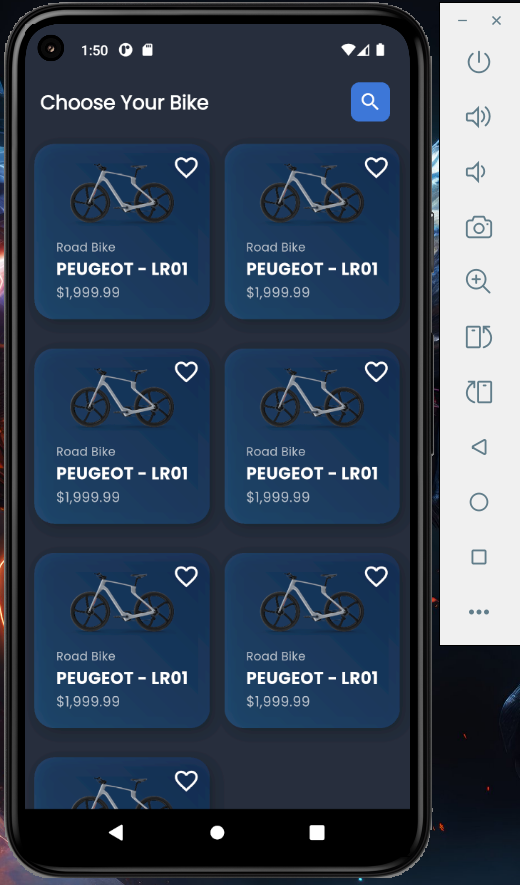

# BikeStore App 📱​

App de loja de bicicletas

## 🚀 Começando


### 📋 Pré-requisitos

Para rodar o projeto é necessáro ter o [SDK do Flutter](https://flutter.dev/) instalado.

```
version: 3.29.2^
```

### 🔧 Instalação

Com o [Git](https://git-scm.com/downloads) e o [SDK do Flutter](https://flutter.dev/) instalado na máquina, rode os seguintes comandos no terminal:

Passo 1:
```
git clone https://github.com/devdouglasa/bikestore-app.git
```

Passo 2:
```
cd bikestore-app
```

Passo 3:
```
flutter pub get
```

Passo 4:
```
flutter run
```

Termine com um exemplo de como obter dados do sistema ou como usá-los para uma pequena demonstração.

## ⚙️ Imagens do Projeto



## 🛠️ Construído com

<div>


</div>


---
Desenvolvido por [Douglas Alisson](https://github.com/devdouglasa) 😊